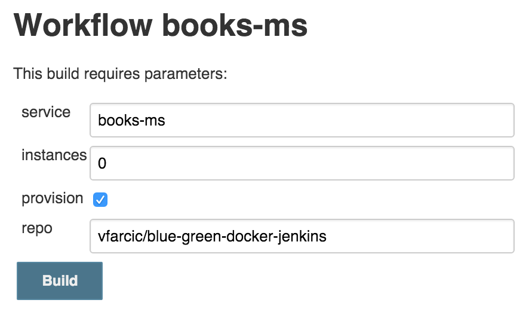
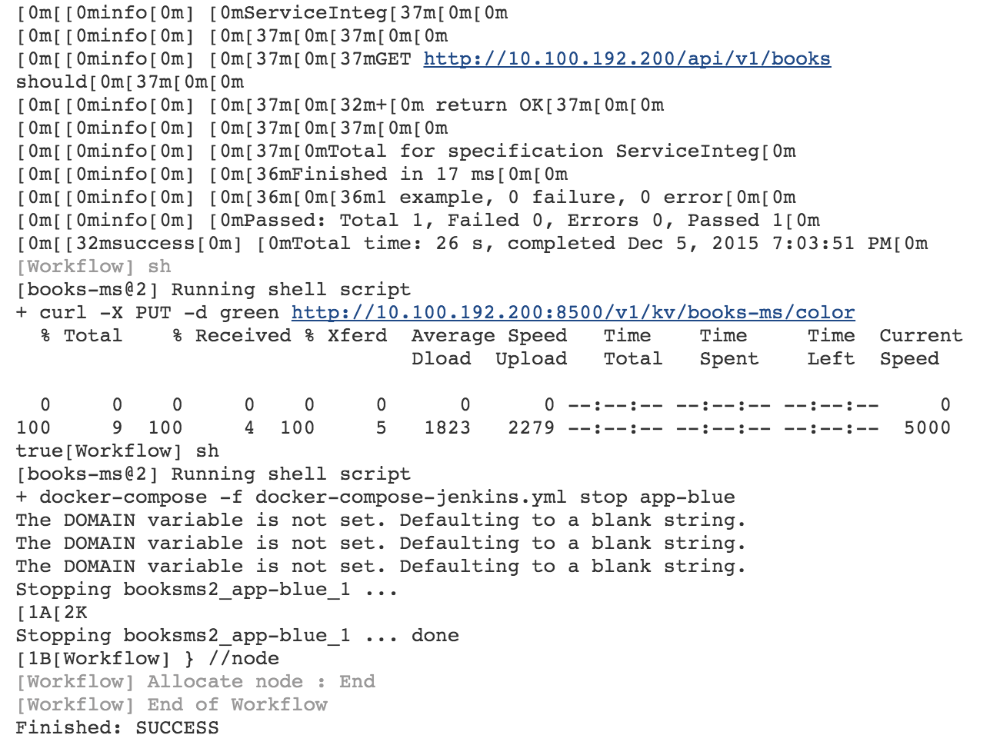

Blue-Green Deployment Workflow To Docker Swarm with Jenkins
===========================================================

The idea behind this article is to explore ways to deploy releases to [Docker Swarm](https://docs.docker.com/swarm/) without downtime. We'll use *blue-green* process. More info about the process and one possible implementation can be found in the [Blue-Green Deployment, Automation and Self-Healing Procedure](http://technologyconversations.com/2015/07/02/scaling-to-infinity-with-docker-swarm-docker-compose-and-consul-part-34-blue-green-deployment-automation-and-self-healing-procedure/) article. One of the downsides of the process we used in that article is Ansible itself. While it is probably the best tool for provisioning and orchestration, it had some downsides when we tried to use it as the tool to deploy containers especially if the process is complex. It lacked some constructs common in most programming languages. This time we'll try to implement the same process but using the [Jenkins Workflow Plugin] and a bit of Groovy scripts.

TODO: Explain the BG process

Let's see it in action first and then discuss how it was done.

Setting Up Docker Swarm Cluster and Jenkins
-------------------------------------------

We'll start by creating the cluster we'll need for running Docker Swarm. We'll use VirtualBox and Vagrant to create the VMs and then provision them with Ansible. I won't go into details how Ansible playbooks we'll run work since that information can be found in other articles in this blog. The setup will be similar to the one described in the [Deploying Containers with Docker Swarm and Docker Networking](http://technologyconversations.com/2015/11/25/deploying-containers-with-docker-swarm-and-docker-networking/) article published recently. The major difference will be the addition of Jenkins.

I'll assume that you already have [VirtualBox](https://www.virtualbox.org/), [Vagrant](https://www.vagrantup.com/) and [Git](https://git-scm.com/) installed. If you are a Windows user, please follow the instructions described in [Running Linux VMs on Windows](http://technologyconversations.com/2015/11/24/running-linux-vms-on-windows/) before diving into those described below.

Let's get going! We can create the servers by running the following command.

```bash
git clone https://github.com/vfarcic/blue-green-docker-jenkins.git

cd blue-green-docker-jenkins

vagrant up swarm-master swarm-node-1 swarm-node-2
```

Next, we should provision servers with Docker Swarm, Docker Compose, Consul, Consul Template and Registrator. If you are new to Docker Swarm, you might benefit from reading the [Docker Clustering Tools Compared: Kubernetes vs Docker Swarm](http://technologyconversations.com/2015/11/04/docker-clustering-tools-compared-kubernetes-vs-docker-swarm/) article. Information about Consul and the other tools we'll use for service discover can be found in the [Service Discovery: Zookeeper vs etcd vs Consul](http://technologyconversations.com/2015/09/08/service-discovery-zookeeper-vs-etcd-vs-consul/) article.

It might take some time to create all three servers especially if this is the first time you're using Vagrant with Ubuntu. Once they are up and running, we can use Ansible to configure the cluster. Since the creation of VMs included installation of Ansible in the *swarm-master* node, we can use it to run the [swarm.yml](https://github.com/vfarcic/blue-green-docker-jenkins/blob/master/ansible/swarm.yml) playbook.

```bash
vagrant ssh swarm-master

ansible-playbook /vagrant/ansible/swarm.yml \
    -i /vagrant/ansible/hosts/prod
```

Finally, the only thing left is to set up Jenkins. We'll continue using Ansible for this task. It will create few directories, run the Jenkins container, fiddle with few configurations, install plugins we'll need and, finally, create the job that will do the actual deployment. Since the focus of this article is to experiment with Jenkins Workflow in the context of blue-green deployment to the Swarm cluster, I'll skip explanations how the [jenkins.yml](https://github.com/vfarcic/blue-green-docker-jenkins/blob/master/ansible/jenkins.yml) playbook works. Feel free to take a look at the code or to post a comment and, if there is enough interest, I'll write a separate article about setting up Jenkins with Docker and Ansible.

```bash
ansible-playbook /vagrant/ansible/jenkins.yml \
    -i /vagrant/ansible/hosts/prod
```

Exploring The Jenkins Workflow
==============================

Let's start the build. Since the first run last a bit longer than consecutive runs, we'll us that time to discuss the solution. Please open [http://10.100.192.200:8080/job/books-ms/build?delay=0sec](http://10.100.192.200:8080/job/books-ms/build?delay=0sec) and click the *Build* button. You can monitor progress by opening the [http://10.100.192.200:8080/job/books-ms/lastBuild/console](http://10.100.192.200:8080/job/books-ms/lastBuild/console) page.



While the job is running, let's take a quick look at the [docker-compose.yml](https://github.com/vfarcic/blue-green-docker-jenkins/blob/master/docker-compose.yml) that we'll use to run tests and deploy the service.

```yml
app:
  image: vfarcic/books-ms
  ports:
    - 8080
  environment:
    - SERVICE_NAME=books-ms
    - DB_HOST=books-ms-db

app-blue:
  environment:
    - SERVICE_NAME=books-ms-blue
  extends:
    service: app

app-green:
  environment:
    - SERVICE_NAME=books-ms-green
  extends:
    service: app

db:
  container_name: books-ms-db
  image: mongo
  environment:
    - SERVICE_NAME=books-ms-db

integ:
  image: vfarcic/books-ms-tests
  volumes:
    - ./src:/source/src
  environment:
    - TEST_TYPE=integ
    - DOMAIN=$DOMAIN
```

The *app* target represents our main service. However, since we'll need to distinguish *blue* from *green* deployments, there are two additional targets called *app-blue* and *app-green*. They both extend the *app* target in order to avoid repetition. We're passing the environment variable *SERVICE_NAME* that will help [Registrator](https://github.com/gliderlabs/registrator) better define the service before sending the information to [Consul](https://github.com/gliderlabs/registrator). The truly important part are target names. Apart from main targets, we have the MongoDB identified as *db* and the *integ* target that we'll use for running tests.

With Docker Compose out of the way, we can proceed and explore the Groovy script [service-flow.groovy](https://github.com/vfarcic/blue-green-docker-jenkins/blob/master/ansible/roles/jenkins/templates/service-flow.groovy) that will do the actual deployment. Please note that, for simplicity, I skipped steps that build containers, run unit and functional tests and push container to the registry. You're advised to put them inside the workflow we are about to explore. In this case, the Groovy script assumes that those steps were already performed in a separate process and that the container we are about to deploy is validated.

First we should declare few variables.

```groovy
def swarmMaster = "10.100.192.200"
def proxy = "10.100.192.200"
def currentColor = getCurrentColor(swarmMaster, service)
def nextColor = getNextColor(currentColor)
def instances = getInstances(swarmMaster, service)
```

The *swarmMaster* and *proxy* represent IPs that we'll use later on. The *currentColor* and the *nextColor* are declared through functions that consult Consul and retrieve values of the color that is currently deployed as well as the color we are about to deploy. Finally, we are discovering how many instances we should deploy. The *getInstances* function has two conditionals. If *instances* parameter from the build screen is set to *0*, the function will request this information from Consul that will return the number of instances we are currently running or one if this is the first deployment. On the other hand, if the build parameters is not *0*, it will be used as the *instances* variable. In other words, we can decide how many instances to deploy by setting some value in the Jenkins build screen or let the script deploy the same number of containers as the current release. Please consult the [service-flow.groovy](https://github.com/vfarcic/blue-green-docker-jenkins/blob/master/ansible/roles/jenkins/templates/service-flow.groovy) script if you are interested how those functions work.

We should start by provisioning the cluster. Even though we already setup Swarm and service discovery tools, it is always a good idea to make sure that everything is still running as expected. Besides the cluster we'll need load balancer as well (in this case [nginx](http://nginx.org/)). If everything is properly set, provisioning will take only few seconds. On the other hand, if some process stopped or, as in case of nginx, if was never even running, our provisioning stage will correct that.

Steps:

* Provision Docker Swarm cluster
* Provision load balancer (nginx)

```groovy
node("cd") {
    stage "> Provisioning"
    if (provision.toBoolean()) {
        sh "ansible-playbook /vagrant/ansible/swarm.yml \
            -i /vagrant/ansible/hosts/prod"
        sh "ansible-playbook /vagrant/ansible/nginx.yml \
            -i /vagrant/ansible/hosts/prod --extra-vars \
            \"proxy_host=swarm-master\""
    }
...
```

We started by declaring that the steps will run inside the Jenkins node called or labeled *cd* (short for continuous deployment). For simplicity, in this case *cd* is one of the labels of the *swarm-master* node. In production, you should run as much as possible in dedicated servers and not in production. Next is the *stage* declaration that serves multiple purposes. It marks a group of steps, allows us to constrain concurrency and, if you choose to use [CloudBees Jenkins Enterprise Edition](https://www.cloudbees.com/products/cloudbees-jenkins-platform/enterprise-edition), provides visualization, ability to restart from selected stage and few other features. Below the stage, you'll notice that the commands are inside an `if` statement. The value of the *provision* variable comes from the checkbox that you've see in the *build* screen (more about those parameters later on). The "meat" of this snippet are two `sh` statement. It is one of the step types provided by the Workflow plugin and, as you might have guessed, it runs any shell command we specify. In this case, we're using it to run Ansible playbooks that will take care of provisioning. Please note that we did not install nginx when we set up the servers. This script will do that for us.

With provisioning out of the way, we should start the deployment. Since we are deploying already built docker containers, all we need is a *docker-compose.yml* file that is best kept in the same repository as the service code. We can get it by cloning the repository with a simple *git* step.

Steps:

* Clone the code from the repository

```groovy
    stage "> Deployment"
    git url: "https://github.com/${repo}.git"
    env.DOCKER_HOST = "tcp://${swarmMaster}:2375"
```

Please note the usage of the `${repo}`. This is another case of us utilizing parameters that can be specified in the build screen. We're also declaring environment variable *DOCKER_HOST* that points to the *swarm-master* node. From this moment on, all Docker commands we'll run will be sent to Docker Swarm.

Now we are ready to deploy the new release.

Steps:

* Pull the new release
* Run the new release
* Store number of instances we run in Consul

```groovy
    env.DOCKER_HOST = "tcp://${swarmMaster}:2375"
    sh "docker-compose pull app-${nextColor}"
    sh "docker-compose --x-networking up -d db"
    sh "docker-compose rm -f app-${nextColor}"
    sh "docker-compose --x-networking scale app-${nextColor}=$instances"
    sh "curl -X PUT -d $instances http://${swarmMaster}:8500/v1/kv/${service}/instances"
```

First we are setting the *DOCKER_HOST* variable to point to the Swarm Master. From now on, all Docker commands will be sent to that IP/port. Next we're pulling the application. That is followed with deployment of the database and and removal of the target we are about to deploy. Than we are running the service itself. Please note that we are utilizing the *instances* variable to scale the service. Finally, we are sending the number of instances to Consul so that same number is used the next time we run the deployment (unless we change it explicitelly in the Jenkins build screen).

Now that the service is deployed somewhere inside the Swarm cluster, we can move into post-deployment tasks. Please note that if this is not the first deployment, our proxy service would still point to the old release and our users would be oblivious to the existence of the new version we just deployed. Before we reconfigure the proxy, we should test whether the new release is working properly.

Steps:

* Locate the newly deployed service
* Run integration tests

```groovy
    stage "> Post-Deployment"
    def address = getAddress(swarmMaster, service, nextColor)
    try {
        env.DOCKER_HOST = ""
        sh "docker-compose run --rm -e DOMAIN=http://$address integ"
    } catch (e) {
        env.DOCKER_HOST = "tcp://${swarmMaster}:2375"
        sh "docker-compose stop app-${nextColor}"
        error("Pre-integration tests failed")
    }
```

The thing about Swarm is that we are not in full control any more. We do not decide where will the containers be deployed. Docker Swarm did that job for us and now we need to find out where did it deploy our service. Since Registrator stored the information related to the newly deployed release to Consul, all we have to do to find the IP and the port is to query it. That's what the *getAddress* function does. Please consult the [service-flow.groovy](https://github.com/vfarcic/blue-green-docker-jenkins/blob/master/ansible/roles/jenkins/templates/service-flow.groovy) source code if you are interested in seeing the function code. Once we have the location of our service, we are running integration tests. Since we do not want to waste resources on production servers (Docker Swarm), we had to remove the value of the *DOCKER_HOST* variable so that they are run locally. You'll notice that the execution of the tests is inside *try* block. If they fail, script will jump into the *catch* statement. If such a thing happens, we are stopping the container we just deployed and exiting the script with an error.

Now that we know that the release we deployed is working correctly, we can reconfigure the proxy service so that our users can start using it.

Steps:

* Generate nginx configuration
* Copy the configuration to the proxy server
* Reload nginx

```groovy
    sh "consul-template -consul ${swarmMaster}:8500 \
        -template 'nginx-upstreams-${nextColor}.ctmpl:nginx-upstreams.conf' -once"
    stash includes: 'nginx-*.conf', name: 'nginx'
}
node("lb") {
    unstash 'nginx'
    sh "sudo cp nginx-includes.conf /data/nginx/includes/${service}.conf"
    sh "sudo cp nginx-upstreams.conf /data/nginx/upstreams/${service}.conf"
    sh "docker kill -s HUP nginx"
}
```

Changing the nginx configuration is easy with [Consul Template](https://github.com/hashicorp/consul-template). We need a template that, in this case, is stored in the service repository (*nginx-upstreams-blue.ctmpl* and *nginx-upstreams-green.ctmpl*) and run the command. The result is, in this case, the *nginx-upstreams.con* file generated from the template and data stored in Consul.

Please note that everything we did by now was executed in the *cd* node so that there is minimal impact on production servers. Now came the moment to switch to the proxy server (*lb*). For that reason we had to *stash* (archive) the configuration files and, once switched to the *lb* node, unstash (unarchive) them. From there on, we simply copied the files to nginx directories and run the command that reloads it.

With the first round of integration tests we verified that everything works correctly except the proxy itself. The goal was to test as much as possible without affecting our users. Even though it is not part of this article, before the container was built and pushed to the hub, I run all sorts of unit, functional and any other type of tests that can be performed without having the service deployed. Later on we run integration tests that confirmed that the service (after being deployed) is integrated with the database. Now is the time to do the final round of integration tests. We should verify that the changes in the proxy configuration

```groovy
node("cd") {
    try {
        env.DOCKER_HOST = ""
        sh "docker-compose run --rm -e DOMAIN=http://${proxy} integ"
    } catch (e) {
        if (currentColor != "") {
            updateProxy(swarmMaster, service, currentColor)
        }
        env.DOCKER_HOST = "tcp://${swarmMaster}:2375"
        sh "docker-compose stop app-${nextColor}"
        error("Post-integration tests failed")
    }
}
```



TODO: Mention CloudBees Jenkins Platform Enterprise Edition


